### INDEX

- [Configuraciones iniciales](#configuraciones-iniciales)
    - [Enable ssh](#enable-ssh)
    - [Add user](#add-user)
    - [Disable IPv6](#disable-ipv6)
    - [Personalizar dashboard]()

- [Firewall](#firewall)
    - [Firewall rules](#firewall-rules)
    - [Firewall logs](#firewall-logs)
    - [Firewall Aliases](#firewall-aliases)
    - [Firewall ICMP](#firewall-icmp)

- [OpenVPN pfsense](#openvpn-pfsense)
    - [Configuracion de certificados](#configuracion-de-certificados)
        -[Importar certificado](#importar-certificado)
        -[Crear certificado interno]()
    - [Configuración de OpenVPN](#configuración-de-openvpn)
    - [Copia de seguridad y restauración](#copia-de-seguridad-y-restauración)
    - [Configuracion DNS](#configuracion-dns)
    - [Configuracion de reglas firewall](#configuracion-de-reglas-firewall)

### Configuraciones iniciales

#### Enable ssh

~~~bash
System / Advanced / Admin Access > Secure Shell > Secure Shell Server : Enable Secure Shell
~~~

#### Add user

~~~bash
System/User Manager/Users > Add
~~~

#### Disable IPv6

~~~bash
- System/Advanced/Networking>IPv6 Options>Allow IPv6 : uncheck
- Services/DHCPv6 Server >DHCPv6 Options>DHCPv6 Server>Enable DHCPv6 server on interface : uncheck
- Interfaces/WAN>General Configuration>IPv6 Configuration Type : Select none
- Delete or disable some rules firewall IPv6 
~~~

#### Personalizar dashboard

~~~ bash
Status/Dashboard> Select + > select option
System/General Setup> webConfigurator> theme:select theme > reload for apply changes

# Record the source, destination, protocol, ports and state the connection 
Diagnostics> States
~~~

### FIREWALL

#### Firewall rules

+ Firewall / Rules / Lan
+ El orden las reglas es importante, la primera regla sobreescribe a las reglas anteriores

[+] Bloqueo ssh

+ Interfaz LAN bloqueo puerto ssh hacia interfaz CYBER_RANGE

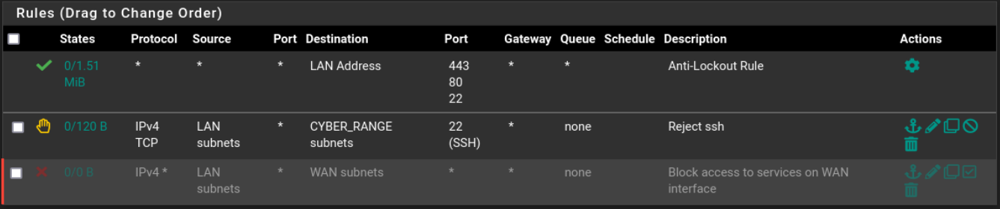

#### Firewall logs

+ Presionamos en filter 
~~~bash
Status/System Logs/Firewall/Normal View
~~~

#### Firewall Aliases

+ Agrupar algunas reglas en una sola (ip/port/url), en este caso agrupamos por puertos

~~~bash
Firewall/Aliases/Ports
~~~

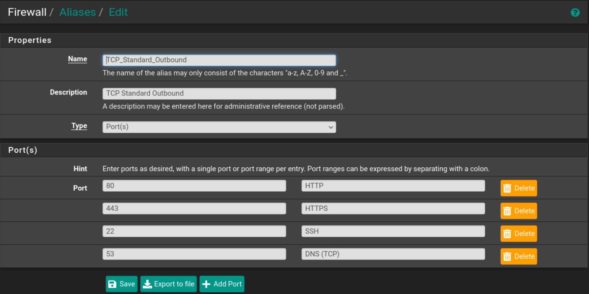

#### Firewall ICMP

+ En las opciones de ICMP subtypes seleccionar estos :
~~~
Echo request
Parameter problem (invalid IP header)
Time exceeded
Destination unreachable
~~~

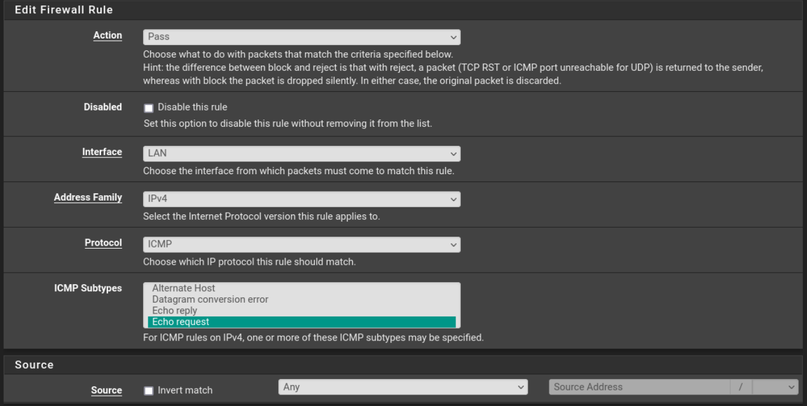

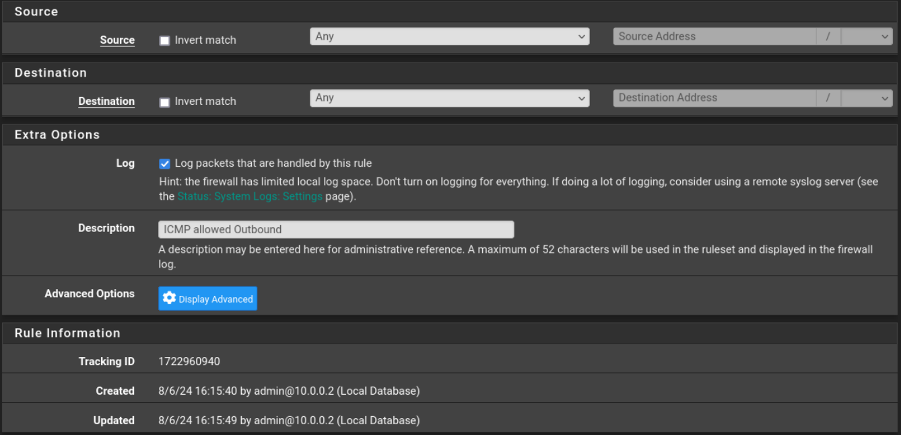

### OpenVPN pfsense

#### Configuracion de certificados

##### Importar certificado

+ Configuracion de CAS

[+] System > Certificate > Authorities > + Add
[+] Tener certificados CAs disponibles, puedes descargar [aqui](https://www.perfect-privacy.com/downloads/openvpn/get?system=pfsense)
[+] Abre cualquier archivo terminado en *.conffiles desde el recurso comprimido descargado, copiar el contenido dentro de las etiquetas <ca></ca>

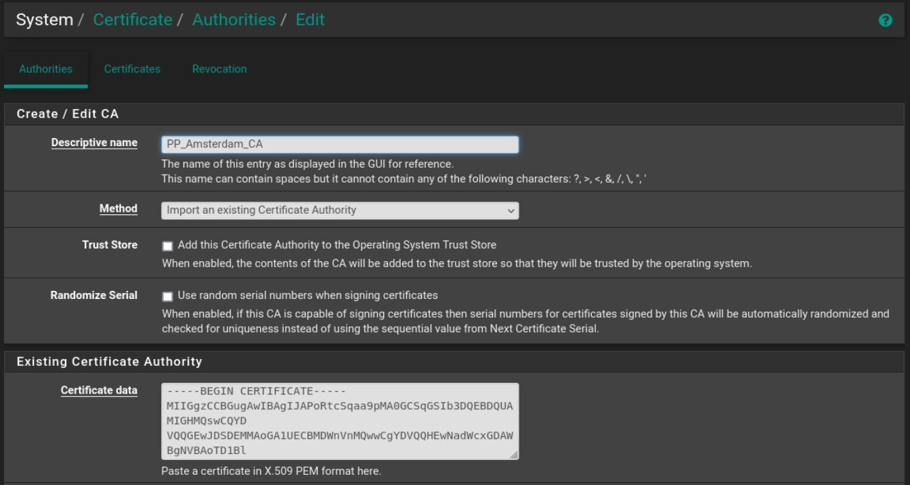

+ Configuracion de Certificado

[+] System > Certificate > Certificates > + Add
[+] En el campo "Certificate Data" copiar el contenido de la etiqueta <cert></cert>
[+] En el campo "Private Key data" copiar el contenido etiqueta <key></key>

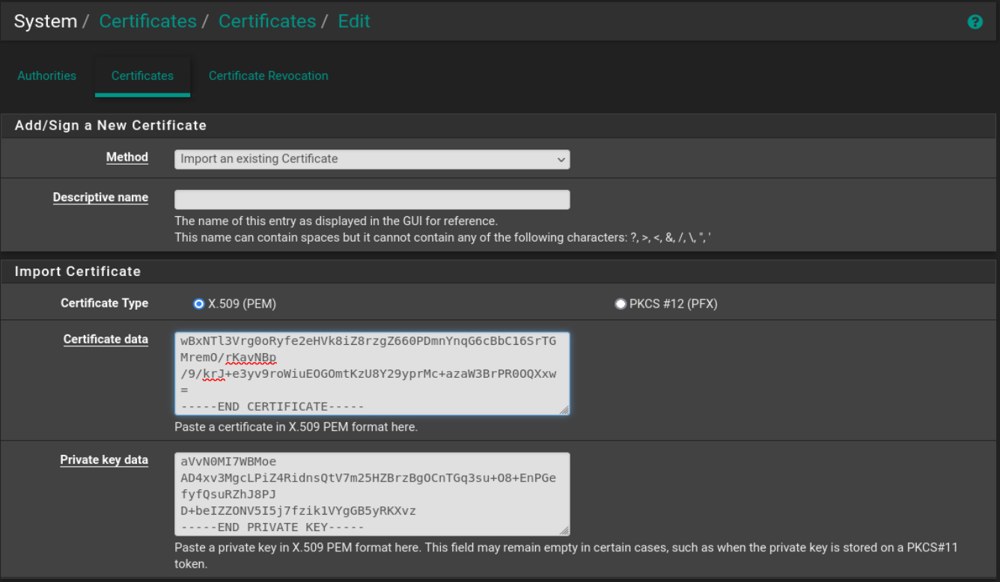

#### Configuración de OpenVPN

[+]VPN > OpenVPN > Clients

[+] General y mode informatiom

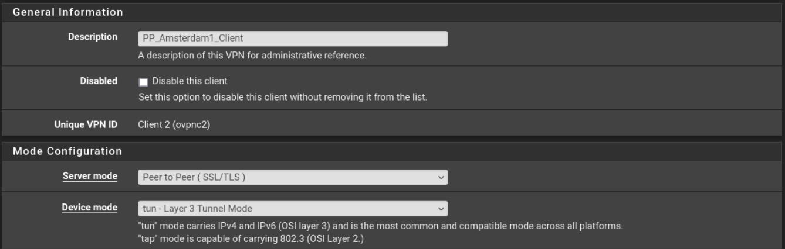

[+] Endpoint configuration

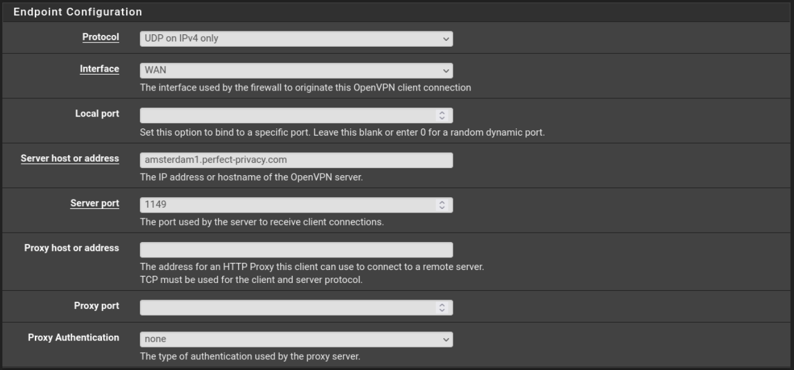

[+] User authentication settings

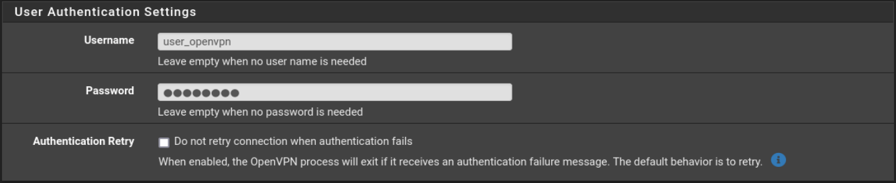

[+] Cryptographic settings

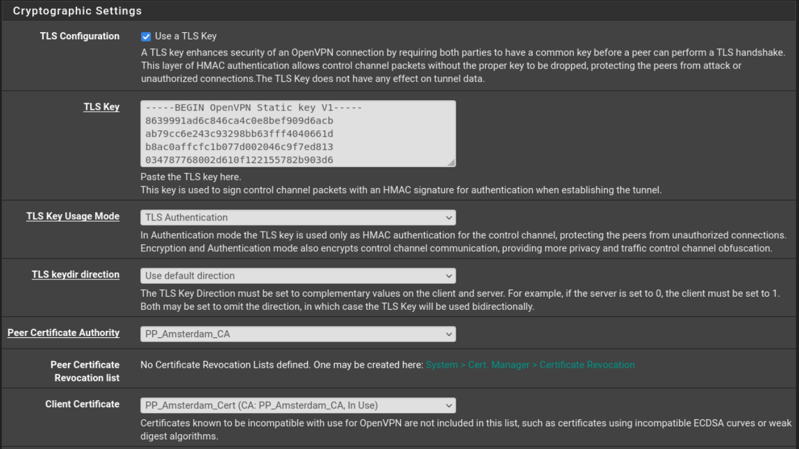
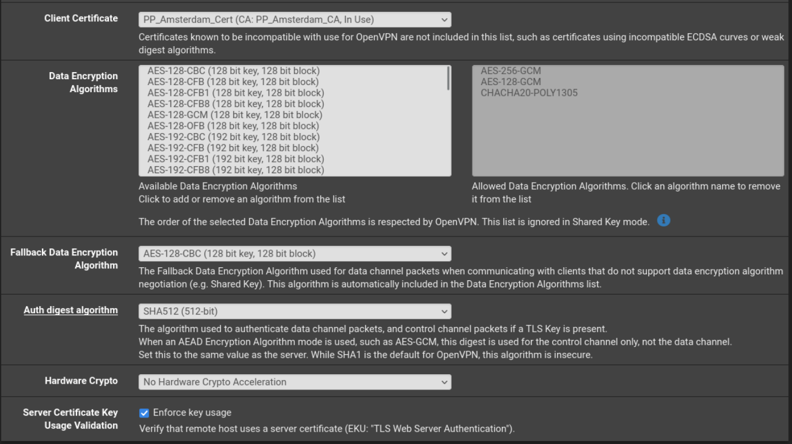

[+] Tunnel settings

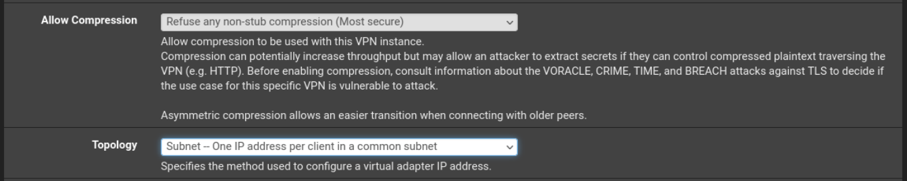

[+] Ping settings

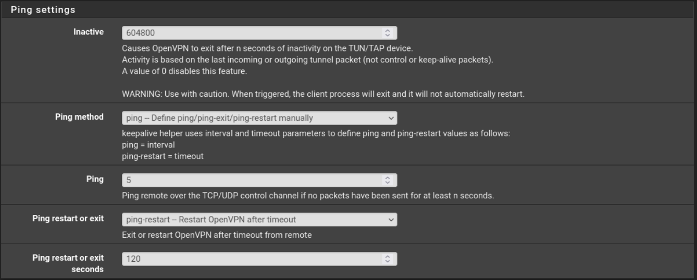

[+] Advanced configuration

+ Copiar esto en el campo "Custom options"
~~~
hand-window 120
mute-replay-warnings
persist-remote-ip
reneg-sec 3600
resolv-retry 60
tls-cipher TLS_CHACHA20_POLY1305_SHA256:TLS-DHE-RSA-WITH-AES-256-GCM-SHA384:TLS-DHE-RSA-WITH-AES-256-CBC-SHA:TLS-DHE-RSA-WITH-AES-128-GCM-SHA256:TLS-DHE-RSA-WITH-AES-128-CBC-SHA:TLS_AES_256_GCM_SHA384:TLS-RSA-WITH-AES-256-CBC-SHA
tls-timeout 5
tun-mtu 1500
fragment 1300
mssfix
remote-cert-tls server
~~~

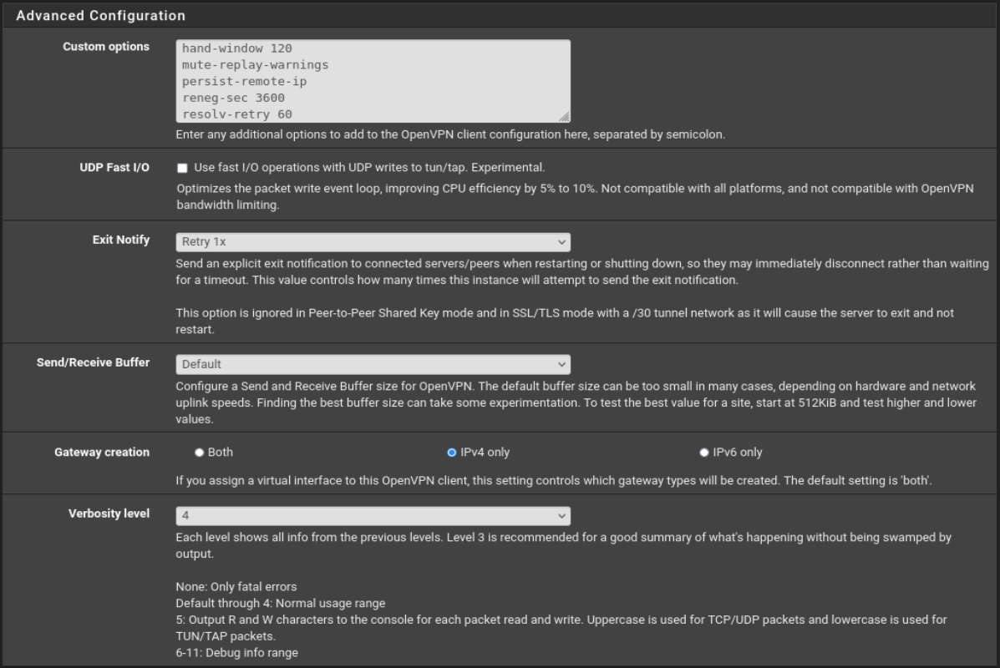

#### Copia de seguridad y restauración

[+] Diagnostic > Backup & Restore > Backup & Restore

+ Presionamos el boton "Download configuration as XSML" para tener una copia 

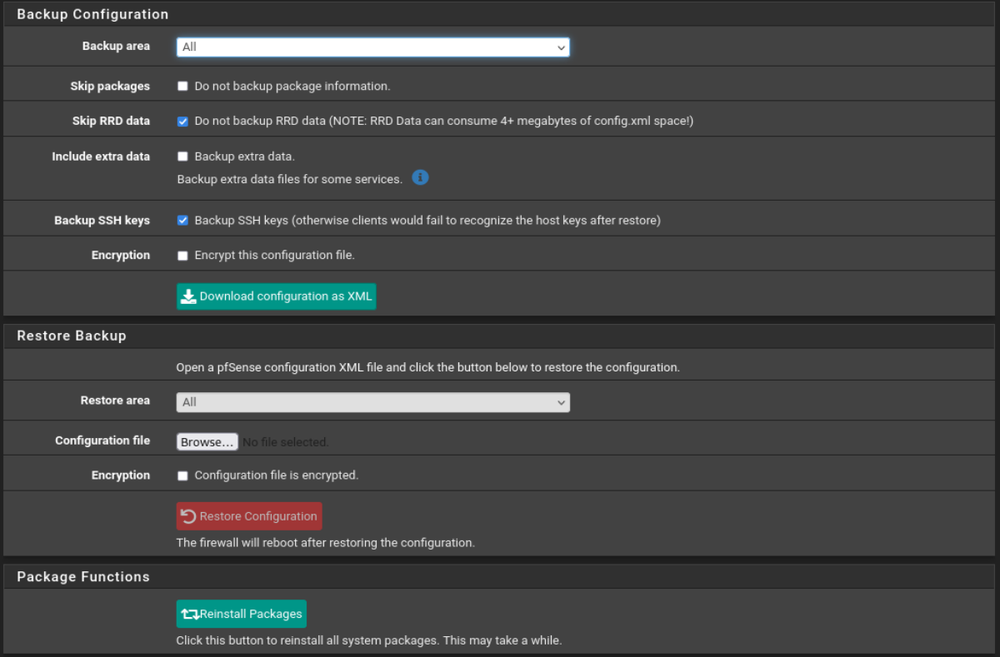

#### Configuracion DNS

[+] System > General Setup

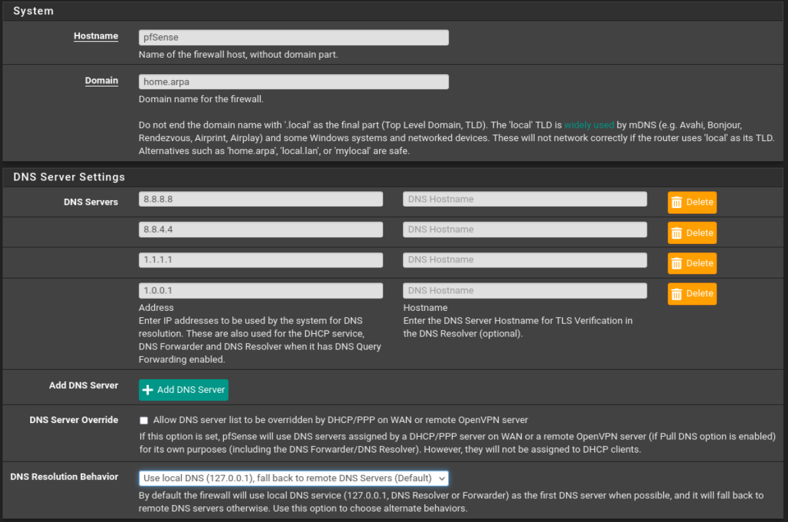

[+] Services > DNS resolver > General Settings

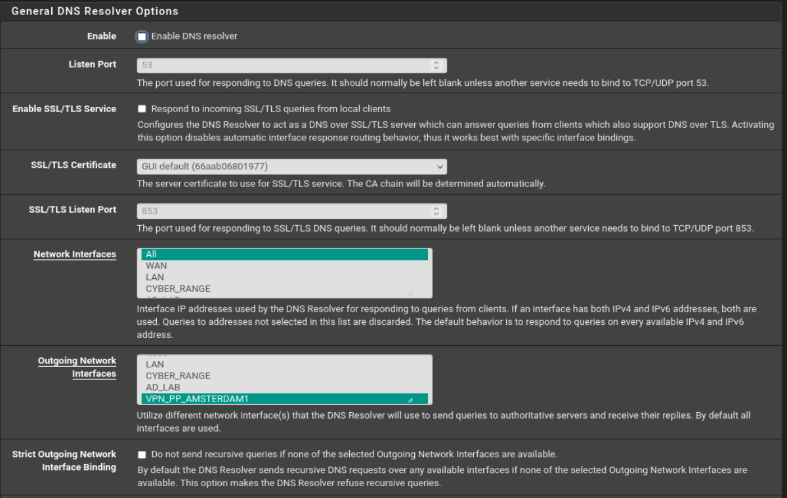

+ DNSSEC: Enable DNSSEC Support

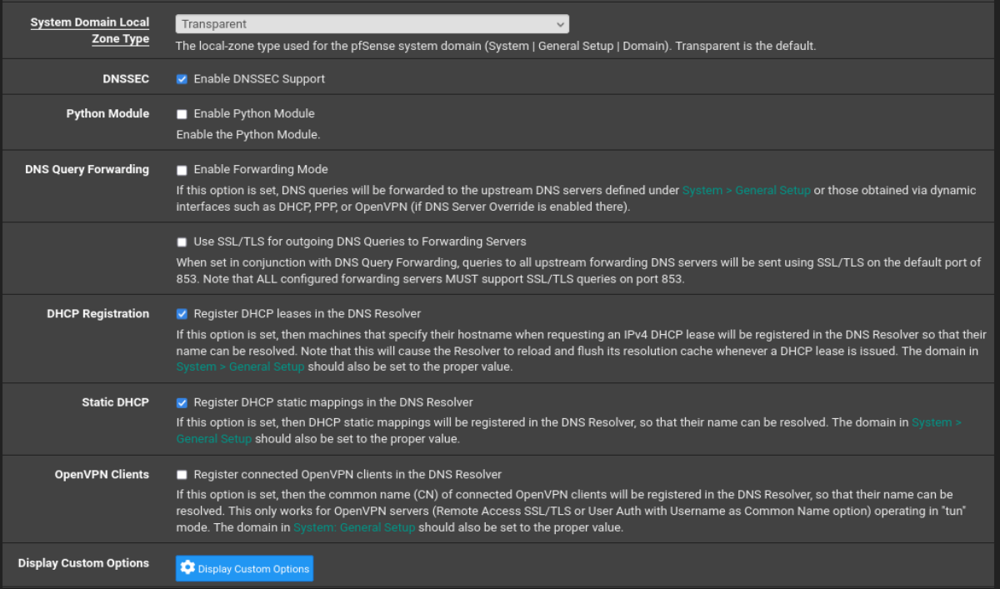

#### Configuracion de reglas firewall

[+] Firewall > Rules > LAN

+ El trafico unicamente pasar por el "gateway VPN_PP_AMSTERDAM1_VPNV4"

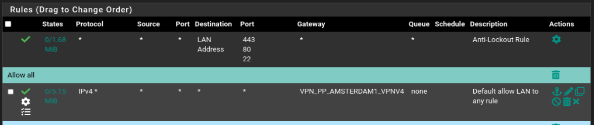

[+] Firewall > Rules > Floating

+ Bloquear trafico en caso VPN esta offline

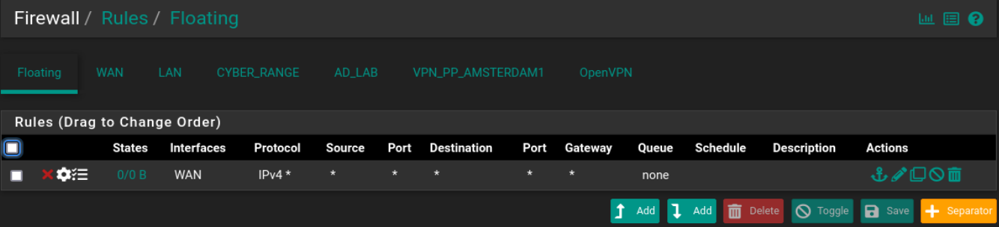

~~~
    Action: Block
    Interface: WAN
    Direction: all
    Address Family: IPv4+IPv6
    Protocol: all
    Source: all
    Destination: all
    Marked/Tagged: NO_WAN_EGRESS
~~~

[+] Firewall > Nat > Outbound

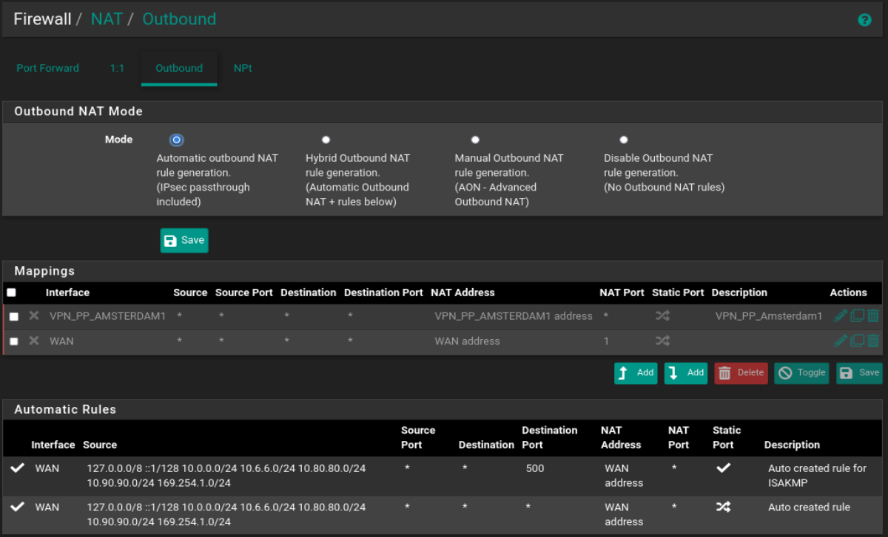

[+] Revisar la conexion si activo la VPN