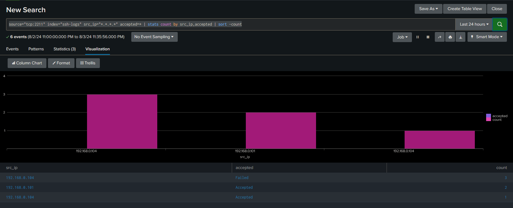
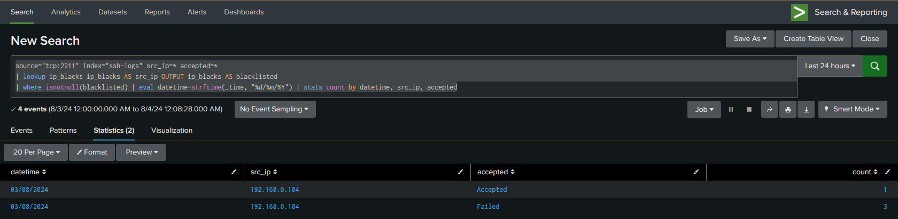
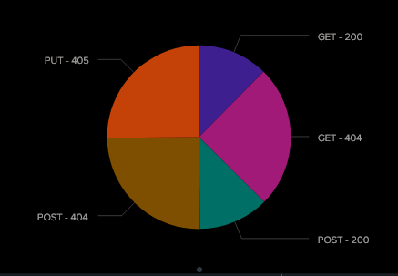

### INDEX

- [Creacion de consultas y extracción de datos](#creacion-de-consultas-y-extracción-de-datos)
- [Desarrollo de Alertas y Correlaciones](#desarrollo-de-alertas-y-correlaciones)
- [Investigación y Análisis de Incidentes](#investigación-y-análisis-de-incidentes)

- [Resources](#resources)

#### Creacion de consultas y extracción de datos

[+] Consultar logs de ssh, validar intentos de login

+ Query splunk
~~~bash
source="tcp:2211" index="ssh-logs" src_ip="*.*.*.*" accepted=* | stats count by src_ip,accepted | sort -count
~~~

[+] Comparar direcciones ip con una lista negra

+ Query splunk
~~~bash
source="tcp:2211" index="ssh-logs" src_ip=* accepted=*
| lookup ip_blacks ip_blacks AS src_ip OUTPUT ip_blacks AS blacklisted
| where isnotnull(blacklisted) | eval datetime=strftime(_time, "%d/%m/%Y") | stats count by datetime, src_ip, accepted
~~~

[+] Mostrar la distribución de códigos de estado HTTP

+ Query splunk
~~~bash
source="tcp:2211" index="ssh-logs" ip_req=* method=* resource=* status_code=*
| stats count by method, status_code
| eventstats sum(count) as total
| eval percentage=round((count/total)*100, 2)
| eval method=method . " - " . status_code
| fields method, status_code, count, percentage
| table method, status_code, count, percentage
~~~

#### Desarrollo de Alertas y Correlaciones

+ Análisis y Consultas: Search Language - Practica el uso del lenguaje de búsqueda de Splunk (SPL) para crear consultas y extraer información útil de los datos.
+ Reglas de Alerta: Configura alertas para eventos específicos como intentos de inicio de sesión fallidos, actividad inusual en la red, o cambios en los archivos críticos.
+ Correlación de Eventos: Usa Splunk para correlacionar eventos de diferentes fuentes para detectar patrones que puedan indicar un incidente de seguridad.

#### Investigación y Análisis de Incidentes:

+ Simulación de Incidentes: Genera datos simulados que imiten un incidente de seguridad, como un ataque de malware o una intrusión en la red.
+ Análisis Forense: Utiliza Splunk para investigar y analizar los datos generados durante el incidente y documenta tus hallazgos.

#### Resources

+ [Splunk - Basic Search](https://www.tutorialspoint.com/splunk/splunk_basic_searching.htm)
+ [How To Build A SIEM with Suricata and Elastic Stack on Ubuntu 20.04](https://www.digitalocean.com/community/tutorials/how-to-build-a-siem-with-suricata-and-elastic-stack-on-ubuntu-20-04#step--5-configuring-filebeat)