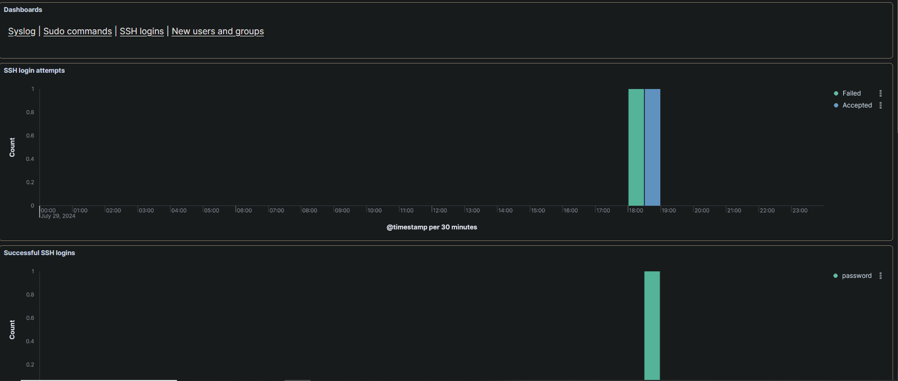
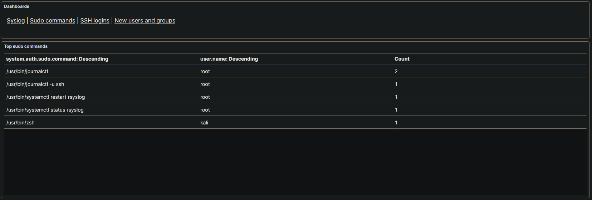
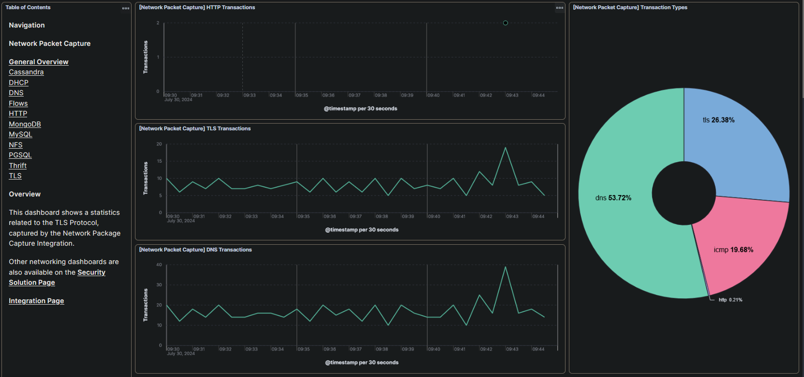
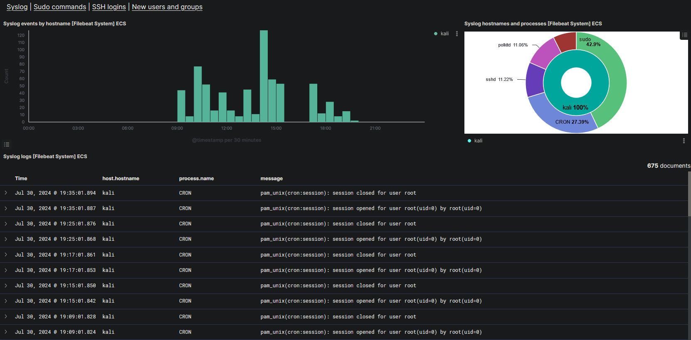
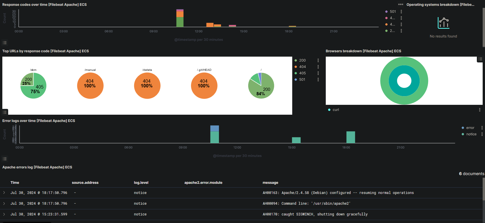

### INDEX

- [Uso Elastic](#uso-elastic)
- [Monitorear Logs y metricas system](#monitorear-logs-y-metricas-system)
- [Logs y metricas apache](#logs-y-metricas-apache)
- [Recursos](#recursos)

### Uso Elastic

Es un motor de búsqueda con capacidades analíticas que permite procesar grandes volúmenes de datos en tiempo real

https://www.elastic.co/es/

#### Monitorear Logs y Metricas system

[+] Logs system
 

[+] Syslog

[+] Nuevos usuarios y grupos

[+] Comandos sudo

[+] Grafica completa

#### Logs y metricas apache

+ Podemos filtrar por solicitudes exitosas y no exitosas y recopilar actores maliciosos que solicitan los recursos

#### Recursos

+ [How To Build A SIEM with Suricata and Elastic Stack on Ubuntu 20.04](https://www.digitalocean.com/community/tutorials/how-to-build-a-siem-with-suricata-and-elastic-stack-on-ubuntu-20-04#step--5-configuring-filebeat)